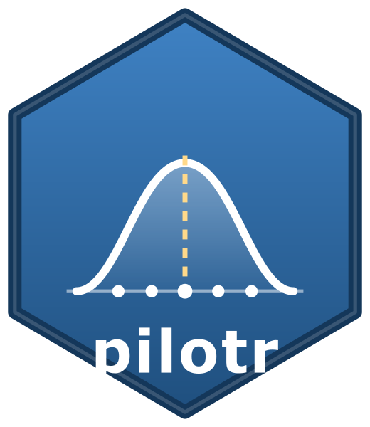

# pilotr, a cross-language toolkit for simulating experimental and behavioural data



[](https://doi.org/10.5281/zenodo.21266313)

`pilotr` lets researchers pilot a study before they run it.

## Why pilotr

Most planning tools ask for one effect size and return one power figure. A real study is
richer: it has groups and conditions, crossed by-subject and by-item variation, and outcomes
that are rarely Gaussian, such as reaction times, accuracy, counts and Likert ratings. pilotr
lets you describe that whole design and then generates the data the design would produce.
Before collecting anything, you can see how often the planned analysis would detect the effect
and, when an estimate does reach significance, how far it would be exaggerated (a Type M error)
or take the wrong sign (a Type S error). In short, it turns a design on paper into evidence
about whether the design is worth running.

## How it works

A design is written once, as a small portable specification. That one specification drives three
interchangeable front-ends which produce identical data: a no-code web app, an R package and a
Python package. Together they close the loop from design to simulation to analysis, and on to
simulation-based power and design analysis.

pilotr succeeds the *Experimental-data-simulation* Shiny app (Bernabeu & Lynott, 2024), archived
on Zenodo (doi:10.5281/zenodo.10615953). The prototype drew marginal distributions only
(`rnorm`/`rbinom`, with no effects, correlations or random structure); pilotr is a generative
toolkit built around effect sizes, random structure and realistic response families.

## Documentation

- **R package** — reference and articles at <https://pablobernabeu.github.io/pilotr/>, including
  a guide to [the no-code app](https://pablobernabeu.github.io/pilotr/articles/the-no-code-app.html).
- **Python package** — guides and API reference at <https://pablobernabeu.github.io/pilotr/py/>.
- **No-code app** — try it in the browser, with nothing to install, at
  <https://pablobernabeu.github.io/pilotr/demo/>.
- **Specification format** — the portable JSON spec and the RNG contract in
  [`spec/SPEC.md`](spec/SPEC.md).

## How pilotr compares to existing tools

| Capability | faux | simstudy | simr / Superpower | **pilotr** |
|---|:--:|:--:|:--:|:--:|
| Generative IV→DV effect sizes | ✗ | ✓ | (from fitted model) | ✓ |
| Crossed by-subject **and** by-item random slopes | ✓ | partial | ✓ | ✓ |
| Realistic distributions (RT/count/ordinal) | ✓ | ✓ | family-dependent | ✓ |
| Simulation-based power + **Type S/M** | ✗ | ✗ | ✓ (power only) | ✓ |
| No-code GUI | ✗ | ✗ | ANOVA only | ✓ |
| **Python implementation** | ✗ | ✗ | ✗ | **✓** |
| **R = Python bit-identical from one spec** | — | — | — | **✓** |

No single existing tool spans these capabilities, and the Python column is empty across the
board. SDV learns from real data, pyDOE3 builds design matrices, Faker produces placeholder
values and the statsmodels power module covers analytic classical tests only.

## Repository layout

```
pilotr/  (repo root)
  spec/          The portable design-specification format (the conceptual core)
    SPEC.md          human-readable format documentation + the RNG contract
    design.schema.json   JSON Schema for validation
    examples/        worked design specs (between-groups; crossed mixed-effects RT)
  python/        pilotr Python package (runnable; pure-Python generative core)
  r/             pilotr R package (mirrors the Python core exactly)
    inst/app/      the no-code Shiny app, bundled in the package (pilotr::run_app())
  app-lite/      serverless (shinylive/webR) build of the light path -> static site
  docs/
    mixed_models_and_design_analysis.md   continuous predictors, interactions, the brms bridge
```

## One model, three interfaces

The same design spec drives a no-code web app, an R package and a Python package. The app is a
thin client: every control writes into the portable JSON spec, which can be downloaded and run
unchanged in either package to obtain identical data.

```r
# launch the no-code app locally (installed package)
pilotr::run_app()
# ...or from source:
shiny::runApp("r/pilotr/inst/app")
```

## Deployment and concurrency

R is single-threaded. One R process runs one computation at a time, and a heavy
simulation-based power run (hundreds to thousands of model fits) blocks every other user
sharing that process. The architecture is therefore split according to how the tool is used.

| Path | How | Concurrency | Use for |
|---|---|---|---|
| Installable (primary) | `pilotr::run_app()` in R, or `import pilotr` for Python scripting (installed from source until released on CRAN and PyPI) | unbounded, each user on their own machine and cores | real work, especially heavy power runs parallelised across cores |
| Serverless demo | `app-lite/` exported with shinylive to a static site on GitHub Pages | unbounded, each browser computes via WebAssembly | a low-cost link for design, simulation and Gaussian power |
| Shared hosted instance | shinyapps.io or ShinyProxy | low and costly | best avoided as the main channel, since it blocks and the prototype's free tier allowed 25 hours per month |

The installable app runs power asynchronously (via `future`/`promises`) so that it does not
block. The serverless build is single-user-per-browser and runs synchronously. Both are driven
by the same spec, so a user can design in the browser demo and then run heavy power locally from
the downloaded spec.

```bash
# build the serverless static site (downloads webR assets on first run)
Rscript app-lite/build_shinylive.R   # -> build/shinylive-demo/

# The published website is built by CI (.github/workflows/site.yml): the pkgdown docs at
# https://pablobernabeu.github.io/pilotr/ and this demo at https://pablobernabeu.github.io/pilotr/demo/
```

## Running at scale (HPC / SLURM)

Simulation-based power and precision analyses are embarrassingly parallel, so they scale well on
a cluster. The `hpc/` directory holds a SLURM array job (`precision_array.slurm` and its runner
`precision_array.R`) that runs one task per sample size, with replicates parallelised across
cores via `mclapply` and results written to project storage.

A reference deployment on the Oxford ARC cluster keeps the code and scripts under
`~/pilotr_toolkit/` in home, and the heavy material (the R library, results and logs) under
`/data/<project>/pilotr_toolkit/`, since the home quota is small. A one-time bootstrap installs
`lme4` and `lmerTest` into the data-area library (`R_LIBS`); the R module already provides
`jsonlite`. Submitting `sbatch hpc/precision_array.slurm` runs the sweep, and a quick smoke test
is `sbatch --export=ALL,N_SIMS=4 --array=0 --partition=devel precision_array.slurm`. Each task
writes one `precision_N<n>.csv`, and these combine into a full precision-vs-*N* curve at a
resolution far beyond a laptop. The simulation core is bit-identical across machines and R
versions, so the cluster reproduces local output exactly.

## Cross-language reproducibility

Native random-number generators differ across ecosystems. R uses Mersenne-Twister with
inversion, whereas NumPy uses PCG64, so a naive port never matches. `pilotr` instead ships a
shared generator implemented identically in both languages.

Uniform deviates come from L'Ecuyer's (1988) combined linear congruential generator, whose
intermediate products stay below 2^53 and so remain exact in IEEE-754 doubles (R) and Python
integers alike. Normal deviates use Wichura's (1988) Algorithm AS 241 inverse-CDF, the algorithm
behind R's `qnorm()`, so they agree to full double precision. Everything else (Cholesky factors
for correlated random effects, and inverse-CDF draws for the Poisson, Bernoulli and ordinal
families) derives from those two in a documented draw order (see `spec/SPEC.md`). The same
specification and seed therefore yield identical data in R and Python, and the generator is
auditable and free of external dependencies.

## Quick start

```bash
# Python: simulate both designs + classical simulation-based power (Type S/M)
python python/examples/run_demo.py

# R: the same, bit-for-bit
Rscript r/pilotr/examples/run_demo.R

# Check that R and Python produce identical data (max abs diff = 0)
python python/examples/parity_check.py

# R: crossed mixed-effects simulation-based power via lme4/lmerTest
Rscript r/pilotr/examples/run_power_mixed.R

# R: validate the generative model (a maximal lmer fit recovers the specified parameters)
Rscript r/pilotr/examples/validate_recovery.R

# Python validation suite
python -m pytest python/tests -q

# Realistic distributions: ordinal (Likert) + Poisson counts
python python/examples/families_demo.py

# Power-vs-N curves + the publication figure
python python/examples/power_curves.py        # Gaussian curve  -> build/*.csv
Rscript r/pilotr/examples/power_curve_mixed.R # crossed mixed curve (slow, lme4)
Rscript r/pilotr/examples/plot_power_curves.R # -> build/power_curves.png

# equivalence with faux and simstudy where they overlap
Rscript r/pilotr/examples/equivalence_faux.R
Rscript r/pilotr/examples/equivalence_simstudy.R

# crossed mixed-effects power in Python (statsmodels), for R and Python capability parity
python python/examples/power_mixed_demo.py

# continuous predictors, interactions and continuous random slopes, with a precision-based
# ROPE design analysis, an N-sweep and a brms bridge (see docs/mixed_models_and_design_analysis.md)
Rscript r/pilotr/examples/precision_design_analysis.R
```

> **R↔Python coverage.** Data generation is bit-identical across languages (proven), and both
> ecosystems run crossed mixed-effects power from the same spec. The LMM estimators, however,
> differ. R (`lme4`/`lmerTest`, REML, correlated random effects) is the reference. Python
> (`statsmodels` MixedLM, crossed variance components) overstates random-slope variance, so it is
> conservative for random-slope designs (for the crossed design, power about 0.48 versus about
> 0.73 from lme4), although it recovers fixed effects correctly (mean estimate about 0.048 versus
> 0.05). The two-group Gaussian power backend is identical in both languages. For correlated
> random slopes, R is the recommended choice.
