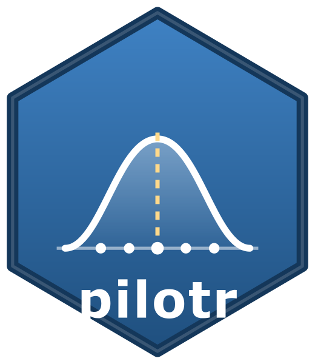

# pilotr, a cross-language toolkit for simulating experimental and behavioural data



<!-- badges: start -->
[](https://github.com/pablobernabeu/pilotr/actions/workflows/R-CMD-check.yaml)
[](https://github.com/pablobernabeu/pilotr/actions/workflows/python-tests.yml)
[](https://pypi.org/project/pilotr/)
[](https://lifecycle.r-lib.org/articles/stages.html#experimental)
[](https://opensource.org/license/MIT)
[](https://doi.org/10.5281/zenodo.21266313)
<!-- badges: end -->

`pilotr` lets researchers pilot a study before they run it.

## Why pilotr

Most planning tools ask for one effect size and return one power figure. A real study is richer
than that. It has groups and conditions, crossed by-subject and by-item variation, and outcomes
that are rarely Gaussian, such as reaction times, accuracy, counts and Likert ratings. pilotr
lets you describe that whole design and then generates the data the design would produce.
Before collecting anything, you can see how often the planned analysis would detect the effect
and, when an estimate does reach significance, how far it would be exaggerated (a Type M error)
or take the wrong sign (a Type S error). In short, it turns a design on paper into evidence
about whether the design is worth running.

## How it works

A design is written once, as a small portable specification. That one specification drives three
interchangeable front-ends which produce identical data, namely a no-code web app, an R package
and a Python package. Together they close the loop from design to simulation to analysis, and on
to simulation-based power and design analysis.

pilotr succeeds the *Experimental-data-simulation* Shiny app (Bernabeu & Lynott, 2024), archived
on Zenodo (doi:10.5281/zenodo.10615953). The prototype drew marginal distributions only
(`rnorm`/`rbinom`, with no effects, correlations or random structure), whereas pilotr is a
generative toolkit built around effect sizes, random structure and realistic response families.

## Documentation

Everything is published from one site, <https://pablobernabeu.github.io/pilotr/>, whose landing
page points at the three parts. The R package's reference and articles live at
<https://pablobernabeu.github.io/pilotr/r/>, including a guide to
[the no-code app](https://pablobernabeu.github.io/pilotr/r/articles/the-no-code-app.html).
The Python package's guides and API reference are at
<https://pablobernabeu.github.io/pilotr/python/>. The no-code app itself can be tried in the
browser, with nothing to install, at <https://pablobernabeu.github.io/pilotr/app/>. The
portable JSON spec and the RNG contract are documented in [`spec/SPEC.md`](spec/SPEC.md).

## Installation

The Python package is on PyPI. The R package has not reached CRAN yet, so it installs from this
repository, where it sits in the `r/pilotr` subdirectory.

```bash
pip install pilotr             # core engine, pure Python and dependency-free
pip install "pilotr[power]"    # + scipy, for simulation-based power
pip install "pilotr[mixed]"    # + scipy, statsmodels and pandas, for crossed mixed-effects power
```

```r
# install.packages("remotes")
remotes::install_github("pablobernabeu/pilotr", subdir = "r/pilotr")
```

Neither package is needed to try the no-code app, which runs entirely in the browser.

## How pilotr compares to existing tools

The table below places pilotr beside the packages researchers most often reach for when planning
a study.

| Capability | faux | simstudy | simr / Superpower | pilotr |
|---|:--:|:--:|:--:|:--:|
| Generative IV→DV effect sizes | ✗ | ✓ | (from fitted model) | ✓ |
| Crossed by-subject and by-item random slopes | ✓ | partial | ✓ | ✓ |
| Realistic distributions (RT/count/ordinal) | ✓ | ✓ | family-dependent | ✓ |
| Simulation-based power + Type S/M | ✗ | ✗ | ✓ (power only) | ✓ |
| No-code GUI | ✗ | ✗ | ANOVA only | ✓ |
| Python implementation | ✗ | ✗ | ✗ | ✓ |
| R = Python bit-identical from one spec | — | — | — | ✓ |

No single existing tool spans these capabilities, and the Python-implementation row is empty
apart from pilotr. SDV learns from real data, pyDOE3 builds design matrices, Faker produces
placeholder values and the statsmodels power module covers analytic classical tests only.

The last row deserves its exact scope, which CI enforces through the parity harness in
[`tools/parity/`](tools/parity). All eight shipped example designs reproduce bit for bit across
the two languages as shipped. With rounding removed, six of the eight still do, and the two whose
response family applies `exp()` to the linear predictor agree to within a few units in the last
place, a tolerance measured and documented in
[`tools/parity/tolerance.json`](tools/parity/tolerance.json). IEEE-754 fixes the rounding of
arithmetic but not of `exp()` and `log()`, and the two languages need not share a maths library.

## Repository layout

```
pilotr/  (repo root)
  spec/          The portable design-specification format (the conceptual core)
    SPEC.md          human-readable format documentation + the RNG contract
    design.schema.json   JSON Schema for validation
    examples/        worked design specs (between-groups; crossed mixed-effects RT)
  python/        pilotr Python package (runnable; pure-Python generative core)
  r/pilotr/      pilotr R package (mirrors the Python core exactly)
    inst/app/      the no-code Shiny app, bundled in the package (pilotr::run_app())
  app-lite/      serverless (shinylive/webR) build of the light path -> static site
  hpc/           SLURM array job for large precision sweeps on a cluster
  tools/parity/  cross-language parity harness: the CI gate behind the bit-identical claim
    tolerance.json   the per-case ulp allowance, and why any case is granted one
    golden.json      hashes of the R dumps, so the two halves cannot drift together
  docs/
    mixed_models_and_design_analysis.md   continuous predictors, interactions, the brms bridge
```

## One model, three interfaces

The same design spec drives a no-code web app, an R package and a Python package. The app is a
thin client. Every control writes into the portable JSON spec, which can be downloaded and run
unchanged in either package to obtain identical data.

```r
# launch the no-code app locally (installed package)
pilotr::run_app()
# ...or from source:
shiny::runApp("r/pilotr/inst/app")
```

## Deployment and concurrency

R is single-threaded. One R process runs one computation at a time, and a heavy
simulation-based power run (hundreds to thousands of model fits) blocks every other user
sharing that process. The architecture is therefore split according to how the tool is used.

| Path | How | Concurrency | Use for |
|---|---|---|---|
| Installable (primary) | `pilotr::run_app()` in R, or `import pilotr` for Python scripting (`pip install pilotr`; the R package installs from this repository until it reaches CRAN) | unbounded, each user on their own machine and cores | real work, especially heavy power runs parallelised across cores |
| Serverless demo | `app-lite/` exported with shinylive to a static site on GitHub Pages | unbounded, each browser computes via WebAssembly | a low-cost link for design, simulation and Gaussian power |
| Shared hosted instance | shinyapps.io or ShinyProxy | low and costly | best avoided as the main channel, since it blocks and the prototype's free tier allowed 25 hours per month |

The installable app runs power asynchronously (via `future`/`promises`) so that it does not
block. The serverless build is single-user-per-browser and runs synchronously. Both are driven
by the same spec, so a user can design in the browser demo and then run heavy power locally from
the downloaded spec.

```bash
# build the serverless static site (downloads webR assets on first run)
Rscript app-lite/build_shinylive.R   # -> build/shinylive-demo/

# The published website is built by CI (.github/workflows/site.yml): the pkgdown docs at
# https://pablobernabeu.github.io/pilotr/r/ and this demo at https://pablobernabeu.github.io/pilotr/app/
```

## Running at scale (HPC / SLURM)

Simulation-based power and precision analyses are embarrassingly parallel, so they scale well on
a cluster. Within one machine, every power and precision analysis takes a `workers` argument
that parallelises the replicates in-process, with results identical to a serial run, while the
SLURM array below covers multi-node sweeps. The [`hpc/`](hpc/) directory holds a SLURM array job
([`precision_array.slurm`](hpc/precision_array.slurm) and its runner
[`precision_array.R`](hpc/precision_array.R)) that runs one task per sample size, with
replicates parallelised across cores via `mclapply` and results written to project storage.

A reference deployment on the Oxford ARC cluster keeps the code and scripts under
`~/pilotr_toolkit/` in home, and the heavy material (the R library, results and logs) under
`/data/<project>/pilotr_toolkit/`, since the home quota is small. A one-time bootstrap installs
`lme4` and `lmerTest` into the data-area library (`R_LIBS`). The R module already provides
`jsonlite`. Submitting [`sbatch hpc/precision_array.slurm`](hpc/precision_array.slurm) runs the sweep, and a quick smoke test
is `sbatch --export=ALL,N_SIMS=4 --array=0 --partition=devel precision_array.slurm`. Each task
writes one `precision_N<n>.csv`, and these combine into a full precision-vs-*N* curve at a
resolution far beyond a laptop. The simulation core is bit-identical across machines and R
versions, so the cluster reproduces local output exactly.

## Cross-language reproducibility

Native random-number generators differ across ecosystems. R uses Mersenne-Twister with
inversion, whereas NumPy uses PCG64, so a naive port never matches. `pilotr` instead ships a
shared generator implemented identically in both languages.

Uniform deviates come from L'Ecuyer's (1988) combined linear congruential generator, whose
intermediate products stay below 2^53 and so remain exact in IEEE-754 doubles (R) and Python
integers alike. Normal deviates use Wichura's (1988) Algorithm AS 241 inverse-CDF, the algorithm
behind R's `qnorm()`, so they agree to full double precision. Everything else (Cholesky factors
for correlated random effects, and inverse-CDF draws for the Poisson, Bernoulli and ordinal
families) derives from those two in a documented draw order (see [`spec/SPEC.md`](https://github.com/pablobernabeu/pilotr/blob/main/spec/SPEC.md)). The same
specification and seed therefore yield identical data in R and Python. That holds bit for bit
for the Gaussian family, for any design that applies no transcendental function to the linear
predictor and for any family with `response.round` set, and to within a few units in the last
place for the unrounded `exp()`/`log()` families, whose rounding IEEE-754 leaves to the maths
library ([`tools/parity/tolerance.json`](tools/parity/tolerance.json) records the measured
rates). The generator is auditable and free of external dependencies.

## Quick start

Every command below runs from the repository root.

### Simulate a design, in either language

The two demo scripts are the shortest way in. Each simulates the bundled designs and runs
classical simulation-based power with the Type S and Type M errors, and the parity check then
confirms that the two languages produce identical data.

```bash
python python/examples/run_demo.py         # Python
Rscript r/pilotr/examples/run_demo.R       # R, bit-for-bit the same
python python/examples/parity_check.py     # max abs diff = 0
```

Realistic response families have a demo of their own, covering ordinal (Likert) outcomes and
Poisson counts.

```bash
python python/examples/families_demo.py
```

### Power and design analysis

Three R scripts cover this ground. The first runs crossed mixed-effects power through `lme4`
and `lmerTest`. The second validates the generative model by fitting a maximal `lmer` model and
checking that it recovers the specified parameters. The third covers continuous predictors,
interactions and continuous random slopes, together with a precision-based ROPE design analysis,
an N-sweep and a brms bridge (documented in
[`docs/mixed_models_and_design_analysis.md`](docs/mixed_models_and_design_analysis.md)).

```bash
Rscript r/pilotr/examples/run_power_mixed.R
Rscript r/pilotr/examples/validate_recovery.R
Rscript r/pilotr/examples/precision_design_analysis.R
```

Python runs crossed mixed-effects power through statsmodels, so the two languages are at
capability parity here, though not at numerical parity. The note closing the Quick start
explains where the two estimators diverge.

```bash
python python/examples/power_mixed_demo.py
```

### Power curves and the publication figure

The Gaussian curve is quick. The crossed mixed curve is slow, because every point on it is a set
of `lme4` fits. A third script draws both into one figure.

```bash
python python/examples/power_curves.py        # Gaussian curve  -> build/*.csv
Rscript r/pilotr/examples/power_curve_mixed.R # crossed mixed curve (slow, lme4)
Rscript r/pilotr/examples/plot_power_curves.R # -> build/power_curves.png
```

### Cross-checks and tests

Two further scripts check that pilotr agrees with faux and simstudy where the three overlap, and
the Python validation suite exercises the generative core.

```bash
Rscript r/pilotr/examples/equivalence_faux.R
Rscript r/pilotr/examples/equivalence_simstudy.R
python -m pytest python/tests -q
```

> A note on R and Python coverage. Data generation is bit-identical across languages (exactly,
> or within the documented ulp tolerance for the unrounded `exp()`/`log()` families), and both
> ecosystems run crossed mixed-effects power from the same spec. The LMM estimators, however,
> differ. R (`lme4`/`lmerTest`, REML, correlated random effects) is the reference. Python
> (`statsmodels` MixedLM, crossed variance components) overstates random-slope variance, so it is
> conservative for random-slope designs (for the crossed design, power about 0.48 versus about
> 0.73 from lme4), although it recovers fixed effects correctly (mean estimate about 0.048 versus
> 0.05). The two-group Gaussian power backend is identical in both languages. For correlated
> random slopes, R is the recommended choice.

## Citation

If pilotr contributes to published work, please cite it.

> Bernabeu, P. (2026). *pilotr: Simulate experimental and behavioural data from a portable design
> specification* (R and Python package version 0.3.0). https://doi.org/10.5281/zenodo.21266313

The About page of each documentation site carries the same reference with a BibTeX entry, for
[the R package](https://pablobernabeu.github.io/pilotr/r/articles/about.html) and for
[the Python package](https://pablobernabeu.github.io/pilotr/python/about/). GitHub builds a
ready-made citation from [`CITATION.cff`](CITATION.cff) through its *Cite this repository*
button.

## Licence

MIT. See [LICENSE](LICENSE).

## Contributing

Issues and pull requests are welcome. The [contributing guide](.github/CONTRIBUTING.md) describes
the development setup and the conventions the toolkit follows, and everyone taking part is asked
to honour the [Code of Conduct](.github/CODE_OF_CONDUCT.md).
