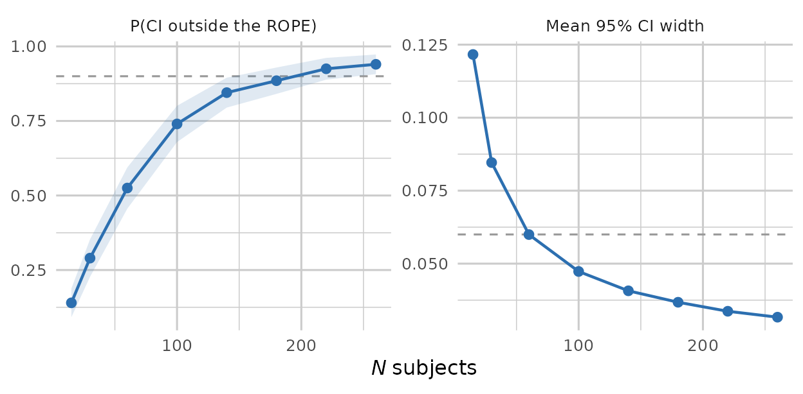

# Precision and ROPE design analysis

``` r

library(pilotr)
```

When sample sizes are large, or when the question of interest is whether
an effect is *practically* meaningful, power against a point null is
often the wrong target. pilotr implements a precision-based design
analysis against a region of practical equivalence (ROPE). This is a
fast, frequentist analogue of the Bayesian approach that compares a
highest-density interval with a ROPE.

> As in the power vignette, the fixed-*N* analysis below uses a small
> `n_sims` so that the vignette builds quickly, and the sample-size
> sweep, which needs far more model fits, was precomputed with exactly
> the code shown and shipped with the package. For real planning we
> recommend `n_sims >= 200`, the value the sweep uses.

## The idea

Over Monte Carlo replicates, and for each focal fixed effect, pilotr
records the 95% confidence interval and whether it falls determinately
outside the ROPE (the effect is practically meaningful) or entirely
inside it (practical equivalence to zero), together with the expected
interval width. The interval is a Wald approximation, the estimate plus
or minus 1.96 standard errors, chosen for speed and for comparability
across replicates. Sweeping sample size then locates the minimum *N* at
which a focal effect reaches a determinate decision with a target
probability.

## A worked design

We reuse the crossed priming design, which represents a small priming
effect on log reaction time.

``` r

spec_c <- build_spec(list(
  name = "priming", seed = 1, design_kind = "within", include_items = TRUE,
  n_subject = 24, n_item = 18,
  factor_name = "condition", lev1 = "related", lev2 = "unrelated",
  intercept = 6, effect = 0.05,
  subj_int_sd = 0.12, subj_slope_sd = 0.04, subj_corr = 0.2,
  item_int_sd = 0.08, item_slope_sd = 0.02, item_corr = -0.1,
  family = "shifted_lognormal", resp_name = "RT", sigma = 0.3, shift = 200))
```

So that the analysis can run from the specification alone, pilotr
auto-derives the analysis model, including the contrast columns, the
response transform and the mixed-model formula.

``` r

model_formula(spec_c)
#> .y ~ effect + (1 + effect | subject) + (1 + effect | item)
```

The companion
[`model_data()`](https://pablobernabeu.github.io/pilotr/reference/model_data.md)
adds the other two derivations to a simulated data set, the numeric
`effect` contrast column the formula’s terms refer to and the `.y`
response, here the log-transformed RT because the family is
`shifted_lognormal`.

``` r

head(model_data(spec_c, simulate_design(spec_c)))
#>   subject item condition       RT       .y effect
#> 1       1    1   related 688.7993 6.191952   -0.5
#> 2       1    1 unrelated 778.3731 6.360219    0.5
#> 3       1    2   related 884.1392 6.528161   -0.5
#> 4       1    2 unrelated 788.8995 6.378256    0.5
#> 5       1    3   related 651.0253 6.111523   -0.5
#> 6       1    3 unrelated 518.3355 5.763106    0.5
```

## Precision at a fixed *N*

We declare the focal effect (its coefficient name and true value) and a
ROPE half-width. Here the effect lives on the log scale, and we treat
anything smaller than 0.02 as practically equivalent to zero.

``` r

pr <- precision_design(spec_c, focal = c(effect = 0.05), rope = 0.02, n_sims = 25)
pr
#>    param true mean_ci_width p_meaningful p_equivalent n_converged
#> 1 effect 0.05    0.09424168         0.24            0          25
```

The columns are interpreted as follows. `p_meaningful` is the
probability the 95% CI lands entirely outside the ROPE, a determinate
‘meaningful’ decision. `p_equivalent` is the probability it lands
entirely inside, a determinate ‘equivalent’ decision. `mean_ci_width` is
the expected precision.

## Sweeping sample size

The same ROPE has to be carried into the sweep. Leaving `rope` at its
default would compare the interval against a region as wide as the
effect itself, and the decision probability would then fall with *N*
rather than rise.

``` r

prc <- precision_curve(spec_c, focal = c(effect = 0.05),
                       subject_ns = c(15, 30, 60, 100, 140, 180, 220, 260),
                       rope = 0.02, n_sims = 200)
prc[, c("n_subject", "p_meaningful", "p_equivalent", "mean_ci_width", "n_converged")]
```

    #>   n_subject p_meaningful p_equivalent mean_ci_width n_converged
    #> 1        15        0.140            0    0.12163610         200
    #> 2        30        0.290            0    0.08462110         200
    #> 3        60        0.525            0    0.05996175         200
    #> 4       100        0.740            0    0.04732256         200
    #> 5       140        0.845            0    0.04069929         200
    #> 6       180        0.885            0    0.03678134         200
    #> 7       220        0.925            0    0.03369284         200
    #> 8       260        0.940            0    0.03166924         200

As *N* grows the interval tightens and `p_meaningful` rises, so the
design reaches a determinate decision more reliably. Reading the sweep
for the smallest *N* that meets a target of ‘`p_meaningful` ≥ 0.90’ puts
this design at around 220 subjects. That is a more informative criterion
than power against a point null, because it asks whether the study can
distinguish the effect from a negligible one rather than merely from
zero. Each estimate rests on 200 replicates, all of which converged, so
its Monte Carlo standard error is at most about 0.035, which the figure
below shows as a band.

`p_equivalent` stays at 0 throughout, and correctly so. The true effect
of 0.05 lies outside the ROPE by construction, so no interval should
ever land entirely inside it. The column earns its place in designs
where practical equivalence is the hypothesis of interest.

``` r

library(ggplot2)
# Each probability is a proportion over the converged replicates, so it carries a binomial
# Monte Carlo standard error, and the band is its 95% interval. The two panels are on
# different scales, hence the free y axis.
prc$se <- sqrt(prc$p_meaningful * (1 - prc$p_meaningful) / prc$n_converged)
panels <- c("P(CI outside the ROPE)", "Mean 95% CI width")
long <- rbind(
  data.frame(n_subject = prc$n_subject, panel = panels[1], y = prc$p_meaningful,
             lo = pmax(0, prc$p_meaningful - 1.96 * prc$se),
             hi = pmin(1, prc$p_meaningful + 1.96 * prc$se)),
  data.frame(n_subject = prc$n_subject, panel = panels[2], y = prc$mean_ci_width,
             lo = NA, hi = NA))
long$panel <- factor(long$panel, levels = panels)
# 0.90 is the target decision probability; 0.06 is the width at which a CI centred on the
# true effect just clears the ROPE, that is 2 * (0.05 - 0.02).
refs <- data.frame(panel = factor(panels, levels = panels), ref = c(0.90, 0.06))

ggplot(long, aes(n_subject, y)) +
  geom_hline(data = refs, aes(yintercept = ref), linetype = 2, colour = "grey60") +
  geom_ribbon(aes(ymin = lo, ymax = hi), alpha = .15, fill = "#2C6FB0", na.rm = TRUE) +
  geom_line(colour = "#2C6FB0", linewidth = 0.8) +
  geom_point(colour = "#2C6FB0", size = 2.2) +
  facet_wrap(~ panel, scales = "free_y") +
  labs(x = expression(italic(N) ~ "subjects"), y = NULL) +
  theme_minimal(base_size = 12) +
  # theme_minimal still paints a white plot.background over the transparent canvas, so both
  # surfaces have to be cleared for the page colour to reach the figure.
  theme(plot.background  = element_rect(fill = NA, colour = NA),
        panel.background = element_rect(fill = NA, colour = NA),
        panel.grid       = element_line(colour = "grey80"),
        strip.background = element_rect(fill = NA, colour = NA))
```



The two panels answer the same question from either side. On the left,
the dashed line marks the 0.90 target the sweep is read against. On the
right it marks a width of 0.06, which is where a confidence interval
centred on the true effect just clears a ROPE of 0.02, since the
interval has to keep its lower limit above the ROPE and so must be
narrower than 2 × (0.05 − 0.02). Width falls below that line well before
the decision probability reaches 0.90, because an interval centred
exactly on the true effect is the best case and sampling variation moves
the centre about.

## See also

The [power
vignette](https://pablobernabeu.github.io/pilotr/articles/power-analysis.md)
covers simulation-based power and Type S/M errors. The [getting-started
vignette](https://pablobernabeu.github.io/pilotr/articles/getting-started.md)
covers the core simulate-and-inspect loop.
