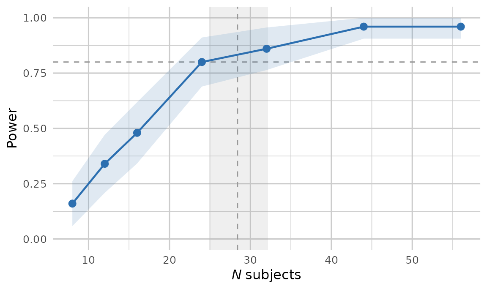

# Power and design analysis

``` r

library(pilotr)
```

Simulation-based power addresses how often an analysis would detect an
effect if the world matched the specification exactly. pilotr estimates
this by repeatedly simulating from the ground-truth specification,
fitting the analysis model and recording the proportion of significant
results. Beyond power, it reports the design-analysis quantities of
Gelman and Carlin (2014), namely the Type S (sign) error and the Type M
(magnitude, or exaggeration) ratio.

> The mixed-effects examples below use small `n_sims`, and their results
> were precomputed with exactly the code shown and shipped with the
> package, so that the vignette builds quickly. For real planning, we
> recommend `n_sims >= 200`, with more replicates for stable Type S and
> Type M estimates.

## Two-group Gaussian

The classic case has a closed-form analytic power, which the simulation
matches.

``` r

spec <- build_spec(list(
  name = "two_group", seed = 1, design_kind = "between", n_subject = 64,
  factor_name = "group", lev1 = "control", lev2 = "treatment",
  intercept = 100, effect = 5, family = "gaussian",
  resp_name = "score", sigma = 10))

pw <- power_design(spec, n_sims = 500)
unlist(pw[c("power", "type_s", "type_m", "true_effect", "mean_estimate")])
```

            power        type_s        type_m   true_effect mean_estimate 
         0.504000      0.000000      1.402398      5.000000      4.987050 

At roughly 50% power, the Type M ratio is well above 1. Conditional on
significance, the estimated effect is exaggerated, even though the
average estimate over all replicates is unbiased. This reflects the
statistical-significance filter, which is precisely what design analysis
is meant to expose.

## Crossed mixed-effects designs

A feature that distinguishes pilotr from a marginal simulator is power
estimation for crossed by-subject and by-item designs. The R interface
fits the maximal model
`y ~ cond + (1 + cond | subject) + (1 + cond | item)` with
`lme4`/`lmerTest` and tests the fixed effect with Satterthwaite degrees
of freedom.

``` r

spec_c <- build_spec(list(
  name = "priming", seed = 1, design_kind = "within", include_items = TRUE,
  n_subject = 24, n_item = 18,
  factor_name = "condition", lev1 = "related", lev2 = "unrelated",
  intercept = 6, effect = 0.06,
  subj_int_sd = 0.12, subj_slope_sd = 0.04, subj_corr = 0.2,
  item_int_sd = 0.08, item_slope_sd = 0.02, item_corr = -0.1,
  family = "shifted_lognormal", resp_name = "RT", sigma = 0.3, shift = 200))
```

``` r

# A tiny replicate count keeps the vignette fast. Use 200 or more for real planning.
pm <- power_mixed(spec_c, n_sims = 20)
unlist(pm[c("power", "type_s", "type_m", "n_converged")])
```

          power      type_s      type_m n_converged 
       0.800000    0.000000    1.193659   20.000000 

`n_converged` reports how many replicates the maximal model actually
fit. This is a useful diagnostic in its own right, since convergence
problems are common in small crossed designs, and it is the denominator
of `power`, which is the significant proportion among the converged
replicates.

[`power_mixed()`](https://pablobernabeu.github.io/pilotr/r/reference/power_mixed.md)
carries its own simulation loop over the portable specification, with no
other power package underneath it. It covers territory pioneered by
[simr](https://doi.org/10.1111/2041-210x.12504) (Green and MacLeod,
2016) and [mixedpower](https://doi.org/10.3758/s13428-021-01546-0)
(Kumle, Vo and Draschkow, 2021). pilotr differs in being driven by the
cross-language specification, in reporting Type S and Type M errors
alongside power and in built-in parallelisation.

## A power curve

The following sweep over the number of subjects reports power at each
size.

``` r

curve <- power_curve_mixed(
  spec_c,
  subject_ns = c(8, 12, 16, 24, 32, 44, 56),
  n_sims = 50)
curve
```

      n_subject power   type_m n_converged
    1         8  0.16 1.998682          50
    2        12  0.34 1.639186          50
    3        16  0.48 1.404611          50
    4        24  0.80 1.189207          50
    5        32  0.86 1.129062          50
    6        44  0.96 1.046713          50
    7        56  0.96 1.048449          50

## The sample size the curve implies

The curve is a means to an end. What the analysis is run for is the
sample size at which power reaches the target, and that is the number a
preregistration quotes. Reading it off the table or the plot judges
points whose Monte Carlo intervals overlap, and yields a bare figure
with no interval attached to it.
[`target_n()`](https://pablobernabeu.github.io/pilotr/r/reference/target_n.md)
fits the curve and inverts the fit, so the crossing is estimated, and
arrives with the uncertainty a simulated curve carries.

``` r

solved <- target_n(curve, target = 0.8)
unlist(solved[c("n", "n_lo", "n_hi")])
```

       n n_lo n_hi 
      29   25   33 

Fifty replicates per point is few, and the interval says so. The fit is
a binomial regression of power on the square root of the sample size,
weighted by the replicates behind each point, and the interval is the
delta-method interval that
[`MASS::dose.p()`](https://rdrr.io/pkg/MASS/man/dose.p.html) computes
for a fitted `glm`. Nothing is extrapolated: a curve that never reaches
the target within the sizes swept is refused, and the refusal reports
the range the sweep did cover.

For a curve swept over something other than sample size,
[`solve_curve()`](https://pablobernabeu.github.io/pilotr/r/reference/solve_curve.md)
is the general form, with `transform = "identity"` where the axis is an
effect size.

Plotting the curve and the solved size together shows what the solve has
done.

``` r

# The transparent device canvas is what lets the page colour through. A ggplot
# theme alone cannot do it, since the device paints white underneath. The
# website's dark mode then inverts the figure's ink, so the axes and labels
# follow the theme and the figure carries no opaque matte.
library(ggplot2)
# Each power estimate is a proportion over the converged replicates, so it
# carries a binomial Monte Carlo standard error. The shaded band is the 95%
# interval.
curve$se <- sqrt(curve$power * (1 - curve$power) / curve$n_converged)
ggplot(curve, aes(n_subject, power)) +
  geom_hline(yintercept = 0.8, linetype = 2, colour = "grey60") +
  # The solved sample size and its interval. The dashed horizontal line marks
  # the target and the band marks where the curve reaches it.
  annotate("rect", xmin = solved$lo, xmax = solved$hi, ymin = -Inf, ymax = Inf,
           fill = "grey60", alpha = .15) +
  geom_vline(xintercept = solved$value, linetype = 2, colour = "grey60") +
  geom_ribbon(aes(ymin = pmax(0, power - 1.96 * se),
                  ymax = pmin(1, power + 1.96 * se)),
              alpha = .15, fill = "#2C6FB0") +
  geom_line(colour = "#2C6FB0", linewidth = 0.8) +
  geom_point(colour = "#2C6FB0", size = 2.6) +
  scale_y_continuous(limits = c(0, 1)) +
  labs(x = expression(italic(N) ~ "subjects"), y = "Power") +
  theme_minimal(base_size = 12) +
  # theme_minimal still paints a white plot.background over the transparent
  # canvas, so both surfaces have to be cleared for the page colour to reach the
  # figure. The ink is left at its default, because the website inverts the
  # figure in dark mode, which turns the dark axis text light, whereas a fixed
  # mid-grey would be inverted into a muddy tan.
  theme(plot.background  = element_rect(fill = NA, colour = NA),
        panel.background = element_rect(fill = NA, colour = NA),
        panel.grid       = element_line(colour = "grey80"))
```



The shaded horizontal band along the curve is the Monte Carlo interval,
the binomial standard error of each power estimate over its converged
replicates widened to a 95% envelope. The vertical band is the solved
sample size and its own interval, which is what the dashed target line
invites the reader to guess at.

## Parallel execution

Every power and precision analysis in pilotr takes a `workers` argument
that spreads the Monte Carlo replicates across local cores. Each
replicate takes its own seed from
[`replicate_seeds()`](https://pablobernabeu.github.io/pilotr/r/reference/replicate_seeds.md),
so the results are identical to a serial run whatever the worker count,
and parallelisation costs nothing in reproducibility. The mixed-model
fits dominate the running time, which makes the speed-up close to linear
in the number of cores. In a sweep the worker pool is created once and
reused across all sample sizes.

``` r

power_curve_mixed(
  spec_c, subject_ns = seq(20, 60, 10), n_sims = 500, workers = 8)
```

This design answers a serial bottleneck familiar from
`simr::powerCurve()`, which this package’s maintainer previously worked
around by splitting the sample-size grid across separate jobs by hand
and recombining the results afterwards ([Bernabeu,
2021](https://pablobernabeu.github.io/2021/parallelizing-simr-powercurve/)).
In pilotr the same gain takes one argument.

## A bridge to the Bayesian workflow

For a confirmatory Bayesian fit,
[`brms_bridge()`](https://pablobernabeu.github.io/pilotr/r/reference/brms_bridge.md)
emits a ready-to-run `brms` model. It provides the family, the fixed and
random-effects formula, and a weakly-informative prior set, all derived
from the same specification, so that the planning model and the
confirmatory model remain consistent.

``` r

brms_bridge(spec_c)
```

    library(brms)
    fit <- brm(
      RT ~ effect + (1 + effect | subject) + (1 + effect | item),
      data   = your_data,
      family = shifted_lognormal(),
      prior  = c(
        prior(normal(0, 2.5), class = "Intercept"),
        prior(normal(0, 0.5), class = "b", coef = "effect"),
        prior(normal(0, 1), class = "sd"),
        prior(lkj(2), class = "cor")
      ),
      chains = 4, iter = 4000, warmup = 2000, cores = 4,
      control = list(adapt_delta = 0.95)
    ) 

## See also

The [precision / ROPE
vignette](https://pablobernabeu.github.io/pilotr/r/articles/precision-rope.md)
covers design analysis against a region of practical equivalence, where
the question is whether an effect is large enough to matter.
